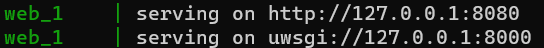
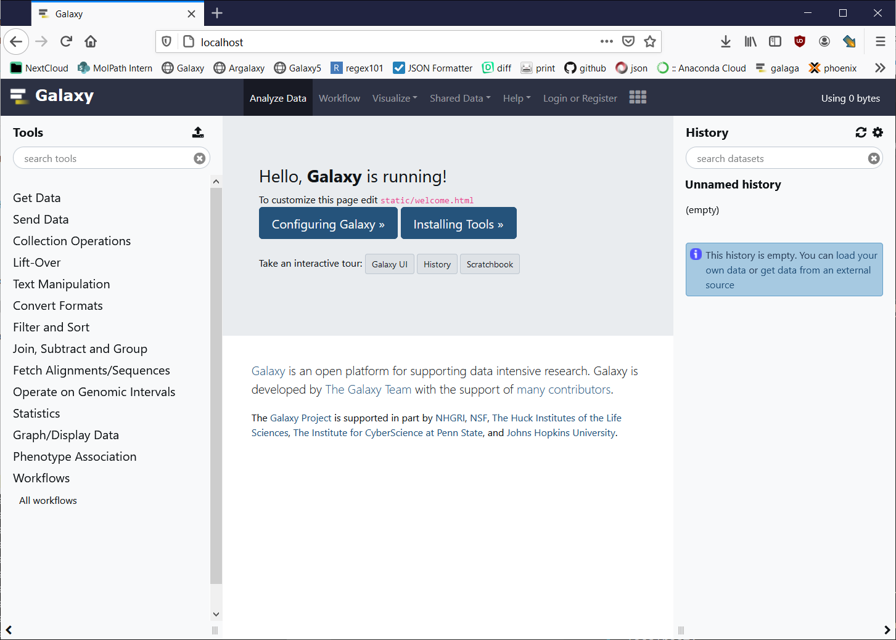
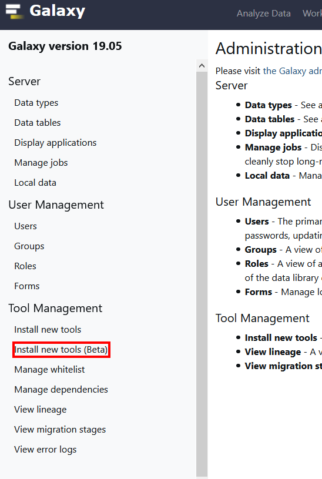
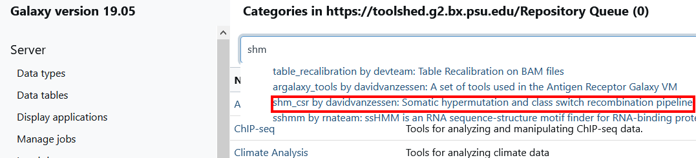
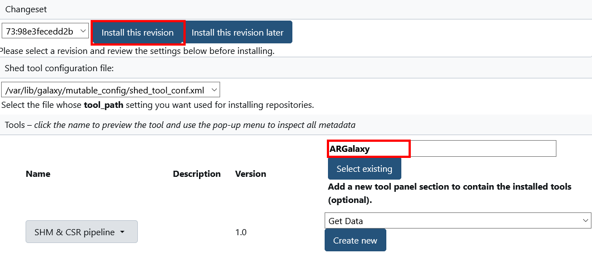
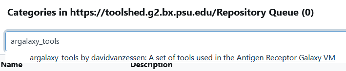
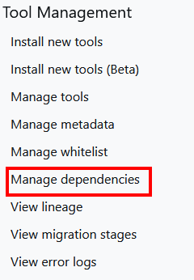
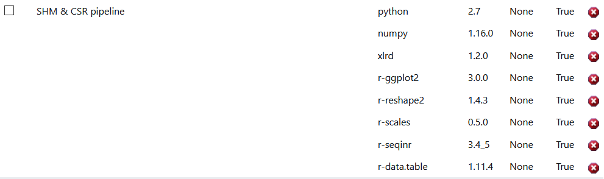
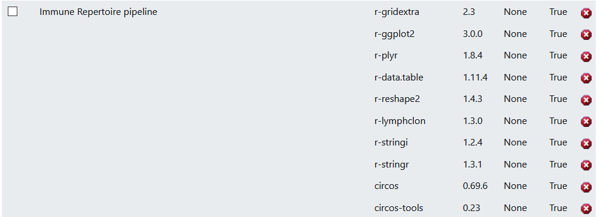
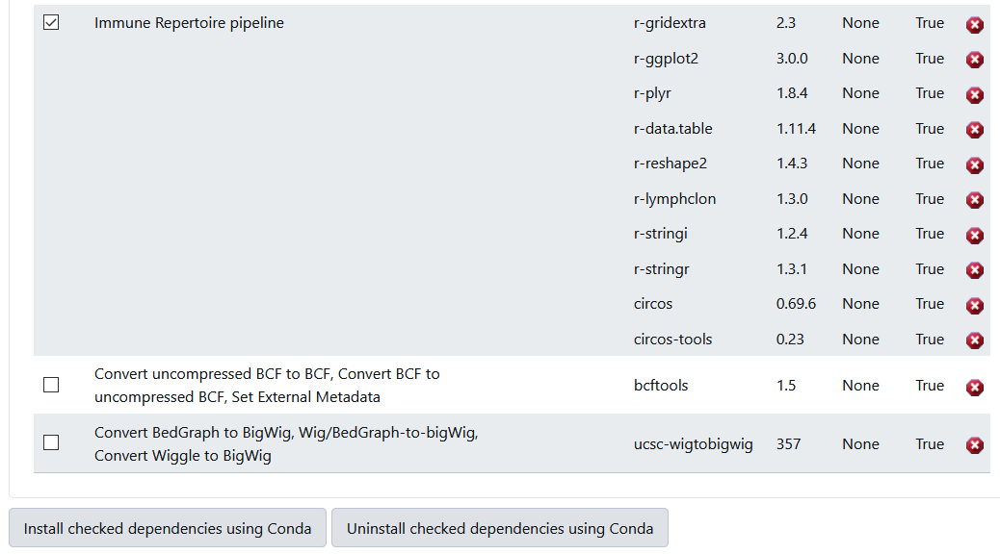

# ARGalaxy docker compose

This is a container that runs [Galaxy](https://galaxyproject.org/), with the dependencies needed to use the ARGalaxy pipelines.

## Before starting

This ARGalaxy server uses [Docker](https://docs.docker.com/engine/install/) and [docker-compose](https://docs.docker.com/compose/install/), so set these up first.

## Config

TODO

## Starting

Clone this repostirory:  
`git clone https://github.com/ErasmusMC-Bioinformatics/ARGalaxy_docker.git`  

Change directory:  
`cd ARGalaxy_docker`  

Start with:  
`docker-compose up --build`  

To start in deamon mode, start with:  
`docker-compose up -d --build`

For a first run, the first command is probably better.

When you see this:  
  
You will know that the Galaxy server is running.

Go to the IP address/URL of the machine that is running Galaxy or localhost:  
- `localhost`
- `127.0.0.1`

You should see the Galaxy page:  

### Admin user

Click on `Login or Register` at the top of the screen, then `register here`, and create a new account with the email address `admin@galaxy.org`.  

You will be automatically logged in and have the `Admin` option available at the top of the screen.  

### Installing the pipelines
####  SHM & CSR

After clicking on the `Admin` page, click on `Install new nools (Beta)` on the left side of the screen:  

Click on `Galaxy Main Tool Shed`, and search for `SHM`, select `shm_csr`:  

Under `Tool Panel Section`, click on `Create new` and fill in `ARGalaxy`, then click on the blue button that says `Install this revision now`:  

This might take a very long time!  

#### Immune Repertoire Pipeline
Repeat this process but for `argalaxy_tools:  

### Dependencies

It is possible that the above steps don't install the ARGalaxy dependencies correctly, we can check this on the `Manage dependencies` section on the `Admin` page:  

Check that for both the `SHM & CSR pipeline` and `Immune Repertoire pipeline` the dependencies are not `None`:  

If they are none, check the checkbox in the first column, scroll down and click `Install checked dependencies using Conda`: 

This will take a long time!
